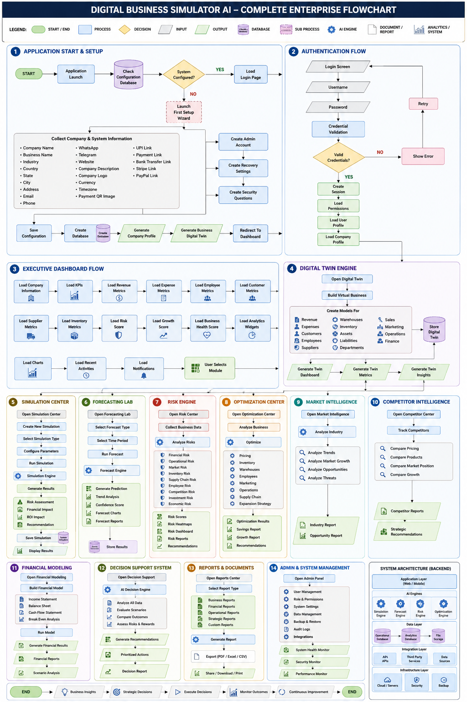
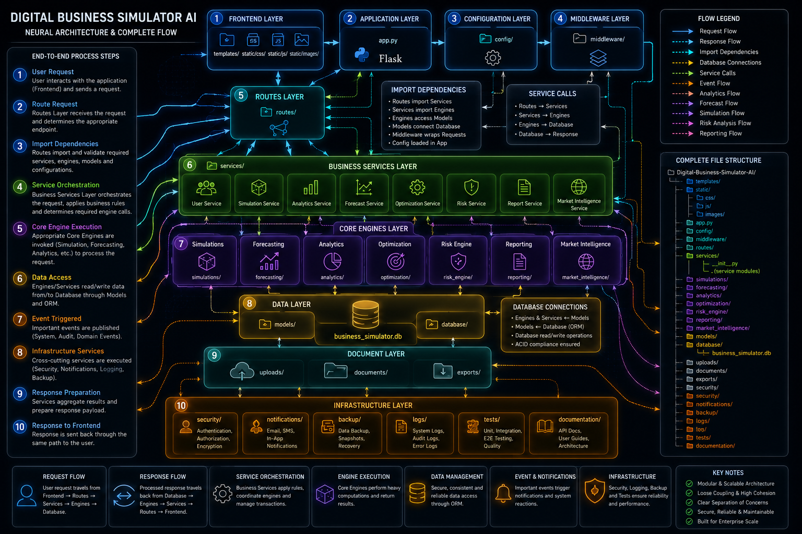
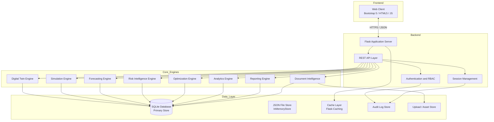
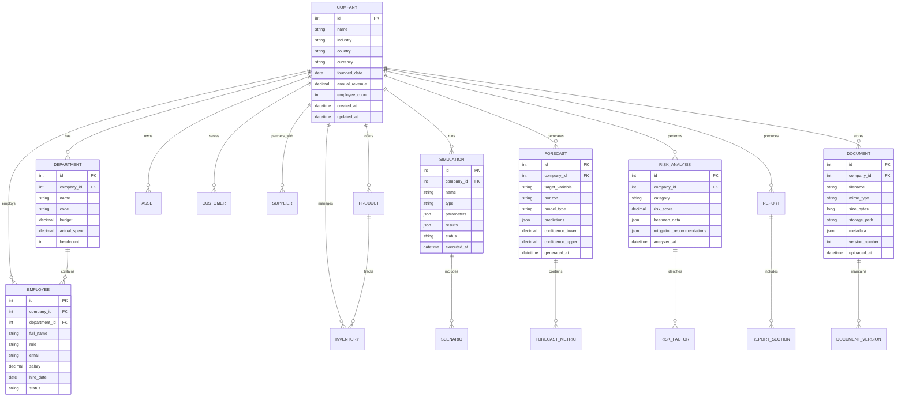
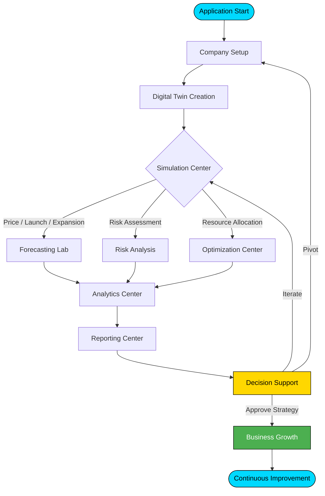

<!-- ═══════════════════════════════════════════════════════════════ -->
<!--  DIGITAL BUSINESS SIMULATOR AI - ENTERPRISE README              -->
<!--  Author: Mohammed Usman | https://github.com/issu321            -->
<!--  Portfolio: https://issu321.github.io/issu321/                  -->
<!-- ═══════════════════════════════════════════════════════════════ -->

<div align="center">

<!-- PREMIUM ANIMATED HERO BANNER -->


<br />

<!-- PREMIUM TAGLINE -->
<sub>🌐 <strong>Enterprise Digital Twin Platform</strong> For Strategic Business Intelligence, Forecasting, Risk Analysis, Optimization, and Decision Simulation.</sub>

<br /><br />

<!-- STATUS & BUILD BADGES -->


<br /><br />

<!-- TECHNOLOGY STACK BADGES -->


<br /><br />

<!-- DOMAIN & FEATURE BADGES -->


<br /><br />

<!-- GITHUB STATISTICS BADGES -->


<br /><br />

<!-- QUICK ACTION BUTTONS -->
<a href="https://issu321.github.io/Large-Scale-Company-Management-Dashboard/">
    
</a>

<a href="https://github.com/issu321/Large-Scale-Company-Management-Dashboard/issues">
    
</a>

<a href="https://github.com/issu321/Large-Scale-Company-Management-Dashboard/issues">
    
</a>

<!-- ═══════════════════════════════════════════════════════════════ -->
<!--  TABLE OF CONTENTS                                              -->
<!-- ═══════════════════════════════════════════════════════════════ -->

---

## 📋 Table of Contents

- [Project Overview](#-project-overview)
- [Key Features](#-key-features)
  - [Digital Twin Engine](#-digital-twin-engine)
  - [Business Simulation Engine](#-business-simulation-engine)
  - [Forecasting Lab](#-forecasting-lab)
  - [Risk Intelligence Engine](#-risk-intelligence-engine)
  - [Optimization Center](#-optimization-center)
  - [Market Intelligence](#-market-intelligence)
  - [Financial Modeling](#-financial-modeling)
  - [Analytics Center](#-analytics-center)
  - [Reporting Center](#-reporting-center)
  - [Document Intelligence Center](#-document-intelligence-center)
- [Enterprise Dashboard](#-enterprise-dashboard)
- [Premium UI / UX](#-premium-ui--ux)
- [System Architecture](#-system-architecture)
- [Project Structure](#-project-structure)
- [Database Design](#-database-design)
- [Installation Guide](#-installation-guide)
- [Application Flowchart](#-application-flowchart)
- [Screenshots](#-screenshots)
- [Performance](#-performance)
- [Security](#-security)
- [Future Roadmap](#-future-roadmap)
- [Contributing](#-contributing)
- [Developer](#-developer)
- [License](#-license)

---

<!-- ═══════════════════════════════════════════════════════════════ -->
<!--  PROJECT OVERVIEW                                             -->
<!-- ═══════════════════════════════════════════════════════════════ -->

## 🎯 Project Overview

**Digital Business Simulator AI** is a next-generation **Business Intelligence and Digital Twin Platform** that creates a high-fidelity virtual representation of your business ecosystem. It empowers executives, analysts, and decision-makers to simulate future scenarios, forecast outcomes, and optimize strategies — **before committing real capital**.

> *"Why risk millions on untested decisions when you can simulate them first?"*

By leveraging advanced AI-driven forecasting, real-time risk intelligence, and comprehensive financial modeling, this platform transforms raw business data into actionable strategic insights. Whether you are testing a new market entry, optimizing supply chains, or forecasting revenue under economic volatility, the Digital Business Simulator AI provides the computational foundation for confident, data-driven leadership.

### 🏢 Suitable For

| Sector | Use Case |
|:---|:---|
| 🚀 **Startups** | Validate business models and funding scenarios before investor pitches |
| 🏭 **SMEs** | Optimize operations, pricing, and workforce planning |
| 🏢 **Enterprises** | Strategic planning, M&A simulation, and multi-departmental forecasting |
| 🏭 **Manufacturers** | Supply chain optimization, inventory forecasting, and demand planning |
| 🛒 **Retail Chains** | Price elasticity modeling, branch expansion, and customer segmentation |
| 📦 **Warehouses** | Capacity planning, logistics optimization, and workforce allocation |
| 🚚 **Logistics Companies** | Route optimization, fleet management, and cost reduction |
| 💼 **Consulting Firms** | Client deliverables, scenario planning, and strategic advisory |
| 🌍 **Import / Export Companies** | Currency risk analysis, tariff impact modeling, and market entry |
| 🌐 **Multi-National Corporations** | Global consolidation, cross-border tax planning, and compliance |

---


## 📊 Project Flowchart

<p align="center">
  
</p>

## 📊 Neural-Workflow

<p align="center">
  
</p>

<!-- ═══════════════════════════════════════════════════════════════ -->
<!--  KEY FEATURES                                                   -->
<!-- ═══════════════════════════════════════════════════════════════ -->

## 🚀 Key Features

<div align="center">

### 🏢 Digital Twin Engine

</div>

| Capability | Description |
|:---|:---|
| **Complete Business Modeling** | Holistic virtual representation of organizational structure, processes, and assets |
| **Revenue Modeling** | Multi-stream revenue architecture with subscription, transactional, and recurring models |
| **Expense Modeling** | Granular cost center tracking with fixed, variable, and operational expenditure categorization |
| **Customer Modeling** | Behavioral segmentation, churn prediction, lifetime value calculation, and cohort analysis |
| **Employee Modeling** | Headcount planning, salary progression, attrition forecasting, and skill matrix mapping |
| **Inventory Modeling** | SKU-level tracking, turnover ratios, safety stock calculations, and obsolescence risk |
| **Asset Modeling** | Depreciation schedules, maintenance forecasting, ROI analysis, and asset lifecycle management |
| **Department Modeling** | P&L attribution per department, resource allocation, and cross-functional impact analysis |

---

<div align="center">

### 📊 Business Simulation Engine

</div>

Simulate critical business decisions in a risk-free environment:

| Scenario | Impact Analysis |
|:---|:---|
| 💰 **Price Changes** | Revenue elasticity, demand fluctuation, and competitive positioning |
| 🚀 **Product Launches** | Market penetration, cannibalization risk, and break-even timelines |
| 🏪 **New Branches** | Capital expenditure, regional demand, and operational scalability |
| 👔 **Employee Hiring** | Payroll impact, productivity curves, and organizational scaling |
| 📉 **Employee Reductions** | Cost savings, knowledge retention risk, and morale impact |
| 📢 **Marketing Campaigns** | CAC vs LTV, channel attribution, and budget optimization |
| 🏭 **Supplier Changes** | Cost variance, quality risk, and supply chain resilience |
| 📈 **Inflation** | Margin compression, pricing power, and cost-pass-through strategies |
| 🏛️ **Tax Changes** | Net income impact, jurisdictional arbitrage, and compliance costs |
| 📉 **Economic Recession** | Cash runway, default risk, and defensive portfolio positioning |
| ⚔️ **Competitor Entry** | Market share defense, pricing war scenarios, and differentiation strategy |
| 🌍 **International Expansion** | Regulatory risk, currency exposure, and localization costs |
| 💎 **Investment Decisions** | NPV, IRR, payback period, and sensitivity analysis |

---

<div align="center">

### 🔮 Forecasting Lab

</div>

Predict the future with AI-powered time-series and regression models:

| Forecast Target | Methodologies |
|:---|:---|
| **Revenue** | ARIMA, Prophet, LSTM Neural Networks, Ensemble Methods |
| **Profit & Loss** | Multi-variate regression, scenario weighting, and Monte Carlo simulation |
| **Expenses** | Seasonal decomposition, trend analysis, and variance forecasting |
| **Demand** | Exponential smoothing, causal impact analysis, and market basket modeling |
| **Inventory** | EOQ optimization, reorder point prediction, and lead-time variability |
| **Cash Flow** | Direct and indirect method forecasting with stress-testing |
| **Customer Growth** | Viral coefficient modeling, adoption curves, and saturation analysis |
| **Business Expansion** | Market sizing, TAM/SAM/SOM projections, and capacity planning |

**Forecast Horizons:** `30 Days` • `90 Days` • `180 Days` • `1 Year` • `3 Years` • `5 Years`

---

<div align="center">

### 🛡️ Risk Intelligence Engine

</div>

| Risk Category | Analysis Depth |
|:---|:---|
| **Financial Risks** | Liquidity ratios, debt coverage, credit exposure, and insolvency probability |
| **Operational Risks** | Process failure modes, single-point-of-failure identification, and contingency planning |
| **Market Risks** | Beta calculation, volatility indexing, and correlation matrices |
| **Supply Chain Risks** | Vendor concentration, geopolitical exposure, and alternative sourcing strategies |
| **Investment Risks** | Sharpe ratios, maximum drawdown, and value-at-risk (VaR) computations |
| **Inventory Risks** | Dead stock probability, shrinkage forecasting, and write-off exposure |
| **Competition Risks** | Porter's Five Forces automation, price-war survival modeling, and moat analysis |

**Outputs:** `Risk Scores` • `Risk Heatmaps` • `Executive Risk Reports` • `Mitigation Playbooks`

---

<div align="center">

### ⚙️ Optimization Center

</div>

| Optimization Domain | Algorithms & Methods |
|:---|:---|
| **Pricing** | Dynamic pricing engines, elasticity optimization, and psychological pricing models |
| **Inventory** | Just-in-time balancing, safety stock minimization, and carrying cost reduction |
| **Supply Chain** | Network flow optimization, transportation cost minimization, and hub selection |
| **Workforce** | Shift scheduling, skill-demand matching, and overtime reduction |
| **Warehouses** | Slotting optimization, pick-path minimization, and storage density maximization |
| **Marketing Budgets** | ROAS maximization, channel mix optimization, and attribution modeling |
| **Expansion Plans** | Site selection scoring, cannibalization minimization, and phased rollout sequencing |

---

<div align="center">

### 🌐 Market Intelligence

</div>

| Intelligence Module | Deliverable |
|:---|:---|
| **Industry Trends** | Automated trend detection, sentiment analysis, and emerging technology tracking |
| **Growth Analysis** | CAGR computation, market momentum scoring, and whitespace identification |
| **Opportunity Analysis** | Gap analysis, unmet demand quantification, and entry-barrier assessment |
| **Competitor Analysis** | Benchmarking matrices, feature parity tracking, and strategic response modeling |
| **Benchmarking** | KPI comparison against industry percentiles, best-practice gap analysis |

---

<div align="center">

### 💹 Financial Modeling

</div>

| Model Type | Application |
|:---|:---|
| **Revenue Models** | Top-down and bottom-up forecasting, subscription modeling, and usage-based pricing |
| **Cash Flow Models** | Operating, investing, and financing activity projection with scenario toggles |
| **Investment Models** | CapEx planning, ROI tracking, and hurdle-rate compliance |
| **ROI Models** | Marketing ROI, technology ROI, and human capital ROI attribution |
| **Valuation Models** | DCF, comparable company analysis, and precedent transaction modeling |
| **Expansion Models** | Greenfield vs acquisition analysis, synergy quantification, and integration costs |

---

<div align="center">

### 📈 Analytics Center

</div>

| Analytics Domain | Insights Generated |
|:---|:---|
| **Revenue Analytics** | Attribution, segmentation, seasonality, and anomaly detection |
| **Profit Analytics** | Margin waterfall analysis, contribution mapping, and breakeven visualization |
| **Expense Analytics** | Variance analysis, spend categorization, and cost-per-unit tracking |
| **Customer Analytics** | RFM scoring, journey mapping, and satisfaction correlation |
| **Employee Analytics** | Productivity ratios, engagement correlation, and retention probability |
| **Supplier Analytics** | On-time delivery, quality scorecards, and contract compliance |
| **Department Analytics** | Cost-center efficiency, inter-departmental chargeback analysis |
| **Geographical Analytics** | Regional profitability, currency-adjusted performance, and market penetration |

---

<div align="center">

### 📑 Reporting Center

</div>

**Report Types:**

| Report | Audience | Frequency |
|:---|:---|:---|
| **Executive Reports** | C-Suite | Weekly / Monthly |
| **Investor Reports** | Shareholders / VCs | Quarterly |
| **Board Reports** | Board of Directors | Quarterly / Annual |
| **Growth Reports** | Strategy Team | Monthly |
| **Risk Reports** | Risk Committee | Monthly |
| **Forecast Reports** | FP&A Team | Weekly / Monthly |

**Export Formats:** `PDF` • `Excel (.xlsx)` • `CSV` • `JSON` • `HTML`

---

<div align="center">

### 📂 Document Intelligence Center

</div>

**Supported Formats:**

| Format | Features |
|:---|:---|
| **PDF** | Text extraction, metadata indexing, and annotation tracking |
| **DOCX** | Version comparison, change tracking, and collaborative editing markers |
| **CSV / Excel** | Schema validation, automated parsing, and data lineage |
| **JSON / XML** | Structured ingestion, API payload logging, and transformation audit |
| **Images** | OCR extraction, EXIF metadata, and visual asset cataloging |

**Enterprise Features:** `Document Tracking` • `Metadata Management` • `Version History` • `Enterprise Search` • `Access Control` • `Audit Trails`

---

<!-- ═══════════════════════════════════════════════════════════════ -->
<!--  ENTERPRISE DASHBOARD                                         -->
<!-- ═══════════════════════════════════════════════════════════════ -->

## 🖥️ Enterprise Dashboard

The command center for your digital twin. A single pane of glass for strategic oversight.

| Widget | Description |
|:---|:---|
| **Business Health Score** | Aggregate KPI scoring from 0-100 with trend indicators |
| **Revenue Score** | Real-time revenue performance vs target with pipeline visibility |
| **Risk Score** | Composite risk indicator with color-coded severity thresholds |
| **Growth Score** | Momentum measurement combining market expansion and internal scaling |
| **Efficiency Score** | Operational excellence metric covering OPEX ratio and asset utilization |
| **KPI Monitoring** | Customizable gauge charts, sparklines, and threshold alerts |
| **Executive Widgets** | One-click drill-downs from summary to transaction-level detail |
| **Interactive Charts** | Zoomable, exportable, and filterable D3.js and Chart.js visualizations |

---

<!-- ═══════════════════════════════════════════════════════════════ -->
<!--  PREMIUM UI / UX                                              -->
<!-- ═══════════════════════════════════════════════════════════════ -->

## 🎨 Premium UI / UX

Engineered for executives who demand both beauty and functionality.

| Design System | Implementation |
|:---|:---|
| **Glassmorphism** | Translucent frosted-glass panels with backdrop-filter blur and subtle borders |
| **Aurora Backgrounds** | Animated mesh gradients simulating atmospheric light phenomena |
| **Liquid Glass Effects** | Refractive depth layers with specular highlights and caustic simulations |
| **Premium Cards** | Elevated containers with soft shadows, hover lift animations, and gradient borders |
| **Neural Gradient Themes** | AI-inspired color flows using deep purples, electric blues, and neon teals |
| **Skeleton Loading Screens** | Perceived performance optimization with shimmer placeholders and staged reveals |
| **Smooth Animations** | 60fps CSS transitions, spring-physics micro-interactions, and scroll-triggered reveals |
| **Responsive Layouts** | Mobile-first grid system adapting from 320px to 4K ultrawide displays |
| **Dark Mode** | OLED-optimized deep blacks with reduced eye strain and accent color preservation |
| **Light Mode** | High-contrast accessibility-compliant whites with subtle warm tints |
| **Theme Engine** | Runtime CSS variable injection with persistent user preference storage |

---

<!-- ═══════════════════════════════════════════════════════════════ -->
<!--  SYSTEM ARCHITECTURE                                          -->
<!-- ═══════════════════════════════════════════════════════════════ -->

## 🏗️ System Architecture



### Architecture Layers

| Layer | Technology | Responsibility |
|:---|:---|:---|
| **Presentation** | Bootstrap 5, HTML5, CSS3, JavaScript | Responsive UI, data visualization, user interactions |
| **Application** | Flask, Jinja2, Werkzeug | Request routing, templating, middleware, error handling |
| **API Gateway** | Flask-RESTful, Marshmallow | Serialization, validation, rate limiting, versioning |
| **Business Logic** | Custom Services, Pandas, NumPy | Domain calculations, data transformation, rule engines |
| **AI / ML** | Scikit-Learn, Statsmodels, Prophet | Forecasting, clustering, regression, classification |
| **Data Access** | SQLAlchemy ORM, SQLite | Persistence, querying, migrations, transaction management |
| **Storage** | Filesystem JSON, SQLite | Document metadata, simulation state, audit trails |
| **Security** | Flask-Login, Werkzeug Security | Authentication, authorization, password hashing, CSRF |

---

<!-- ═══════════════════════════════════════════════════════════════ -->
<!--  PROJECT STRUCTURE                                            -->
<!-- ═══════════════════════════════════════════════════════════════ -->

## 📁 Project Structure

```
digital-business-simulator-ai/
├── 📄 app.py                          # Application entry point
├── 📂 config/
│   ├── __init__.py
│   ├── settings.py                    # Global configuration
│   └── development.py                 # Environment overrides
├── 📂 database/
│   ├── schema.sql                     # Database schema definition
│   ├── migrations/                    # Alembic migration scripts
│   └── seeds/                         # Initial data fixtures
├── 📂 models/
│   ├── __init__.py
│   ├── company.py                     # Business entity models
│   ├── financial.py                   # Revenue, expense, asset models
│   ├── employee.py                    # HR and workforce models
│   ├── inventory.py                   # Stock and SKU models
│   ├── customer.py                    # CRM and segmentation models
│   ├── simulation.py                  # Scenario and experiment models
│   ├── forecast.py                    # Prediction result models
│   ├── risk.py                        # Risk analysis models
│   ├── report.py                      # Generated report models
│   └── document.py                    # File metadata models
├── 📂 routes/
│   ├── __init__.py
│   ├── main.py                        # Public and dashboard routes
│   ├── api.py                         # REST API endpoints
│   ├── simulation.py                  # Simulation CRUD and execution
│   ├── forecasting.py                 # Forecast request handlers
│   ├── analytics.py                   # Chart and metric endpoints
│   ├── reporting.py                   # Report generation and export
│   ├── documents.py                   # Upload and intelligence routes
│   └── settings.py                    # Configuration routes
├── 📂 services/
│   ├── __init__.py
│   ├── digital_twin.py                # Twin orchestration service
│   ├── simulation_runner.py           # Scenario execution engine
│   ├── forecast_engine.py             # ML pipeline orchestrator
│   ├── risk_calculator.py             # Risk quantification service
│   ├── optimizer.py                   # Mathematical optimization
│   ├── market_analyzer.py             # External data and benchmarking
│   ├── financial_modeler.py           # Valuation and modeling logic
│   ├── report_generator.py            # PDF/Excel/CSV renderers
│   └── document_parser.py             # OCR and text extraction
├── 📂 simulations/
│   ├── pricing.py                     # Price elasticity simulations
│   ├── launch.py                      # Product launch scenarios
│   ├── expansion.py                   # Branch and market entry
│   ├── workforce.py                   # Hiring and reduction models
│   ├── marketing.py                   # Campaign ROI simulations
│   ├── supply_chain.py                # Supplier and logistics
│   └── macro_economic.py              # Inflation, recession, tax
├── 📂 analytics/
│   ├── revenue.py                     # Revenue analytics modules
│   ├── profit.py                      # Margin and profitability
│   ├── expense.py                     # Cost analysis modules
│   ├── customer.py                    # Behavioral analytics
│   ├── employee.py                    # HR analytics
│   ├── supplier.py                    # Vendor performance
│   ├── department.py                    # Cost-center analytics
│   └── geographic.py                  # Regional performance
├── 📂 forecasting/
│   ├── arima.py                       # ARIMA time-series
│   ├── prophet.py                     # Facebook Prophet wrapper
│   ├── lstm.py                        # Deep learning forecasts
│   ├── ensemble.py                    # Model stacking and blending
│   ├── regression.py                  # Multi-variate regression
│   └── monte_carlo.py                 # Probabilistic simulation
├── 📂 risk_engine/
│   ├── financial.py                   # Credit and liquidity risk
│   ├── operational.py                 # Process and system risk
│   ├── market.py                      # Volatility and beta
│   ├── supply_chain.py                # Vendor and logistics risk
│   ├── investment.py                  # Portfolio risk metrics
│   ├── inventory.py                   # Stock and obsolescence
│   └── competition.py                 # Competitive threat modeling
├── 📂 optimization/
│   ├── pricing.py                     # Price optimization
│   ├── inventory.py                   # Stock level optimization
│   ├── supply_chain.py                # Network optimization
│   ├── workforce.py                   # Scheduling and allocation
│   ├── warehouse.py                   # Layout and slotting
│   ├── marketing.py                   # Budget allocation
│   └── expansion.py                   # Site selection and phasing
├── 📂 market_intelligence/
│   ├── trends.py                      # Trend detection and scraping
│   ├── growth.py                      # Market sizing and CAGR
│   ├── opportunities.py               # Gap and whitespace analysis
│   ├── competitors.py                 # Benchmarking and tracking
│   └── benchmarking.py                # Industry percentile comparison
├── 📂 reporting/
│   ├── templates/
│   │   ├── executive.html             # C-Suite report template
│   │   ├── investor.html              # VC/Shareholder template
│   │   ├── board.html                 # Board presentation
│   │   ├── growth.html                # Strategic growth report
│   │   ├── risk.html                  # Risk committee report
│   │   └── forecast.html              # FP&A forecast report
│   ├── pdf_exporter.py                # WeasyPrint / ReportLab renderer
│   ├── excel_exporter.py              # OpenPyXL generator
│   ├── csv_exporter.py                # Pandas CSV writer
│   └── json_exporter.py               # Structured JSON output
├── 📂 documents/
│   ├── uploads/                       # Raw file storage
│   ├── processed/                     # Extracted text and metadata
│   ├── versions/                      # Version control snapshots
│   └── index/                         # Search index files
├── 📂 uploads/                        # Temporary upload buffer
├── 📂 security/
│   ├── auth.py                        # Login and registration
│   ├── rbac.py                        # Role-based access control
│   ├── audit.py                       # Activity logging
│   ├── encryption.py                  # Data at-rest protection
│   └── csrf.py                        # Cross-site request forgery
├── 📂 themes/
│   ├── dark.css                       # Dark mode stylesheet
│   ├── light.css                      # Light mode stylesheet
│   ├── neural.css                     # Neural gradient theme
│   └── aurora.css                     # Aurora background theme
├── 📂 charts/
│   ├── d3_config.js                   # D3.js visualization configs
│   ├── chartjs_config.js              # Chart.js global settings
│   └── apex_config.js                 # ApexCharts configurations
├── 📂 backup/
│   ├── auto/                          # Scheduled backup snapshots
│   └── manual/                        # User-triggered exports
├── 📂 logs/
│   ├── app.log                        # Application runtime logs
│   ├── error.log                      # Exception and traceback logs
│   ├── audit.log                      # Security and access logs
│   └── simulation.log                 # Experiment execution logs
├── 📂 tests/
│   ├── unit/                          # Unit test suite
│   ├── integration/                   # Integration test suite
│   ├── e2e/                           # End-to-end browser tests
│   └── fixtures/                      # Test data and mocks
├── 📂 documentation/
│   ├── api.md                         # API reference documentation
│   ├── architecture.md                # System design documentation
│   ├── user_guide.md                  # End-user manual
│   ├── admin_guide.md                 # Administrator manual
│   └── deployment.md                  # Production deployment guide
├── 📄 requirements.txt                # Python dependencies
├── 📄 install.sh                      # Linux/macOS installation script
├── 📄 start.sh                        # Application startup script
├── 📄 README.md                       # This file
└── 📄 LICENSE                         # MIT License
```

---

<!-- ═══════════════════════════════════════════════════════════════ -->
<!--  DATABASE DESIGN                                              -->
<!-- ═══════════════════════════════════════════════════════════════ -->

## 🗄️ Database Design

### Storage Architecture

| Store Type | Purpose | Technology |
|:---|:---|:---|
| **Primary Database** | Structured relational data, transactions, ACID compliance | SQLite |
| **Document Store** | File metadata, version history, search index | JSON Filesystem |
| **Cache Layer** | Session data, computed aggregates, frequent queries | In-Memory / Filesystem |
| **Audit Logs** | Immutable activity records for compliance | Append-Only JSONL |

### Entity Relationship Diagram



### Data Retention & Compliance

| Data Class | Retention | Encryption | Backup |
|:---|:---|:---|:---|
| Business Data | 7 Years | AES-256 | Daily Incremental |
| Simulation Results | 3 Years | AES-256 | Weekly Full |
| Audit Logs | 10 Years | AES-256 | Monthly Archive |
| Documents | Per Policy | AES-256 | Real-Time Sync |

---

<!-- ═══════════════════════════════════════════════════════════════ -->
<!--  INSTALLATION GUIDE                                           -->
<!-- ═══════════════════════════════════════════════════════════════ -->

## ⚡ Installation Guide

### Prerequisites

| Requirement | Version | Purpose |
|:---|:---|:---|
| Python | `>= 3.9` | Runtime environment |
| pip | `>= 21.0` | Package management |
| SQLite | `>= 3.35` | Database engine |
| Git | `>= 2.30` | Version control |

---

<details>
<summary><b>🐧 Linux Installation (Ubuntu / Debian / Kali)</b></summary>

```bash
# Clone the repository
git clone https://github.com/issu321/digital-business-simulator-ai.git
cd digital-business-simulator-ai

# Run the enterprise installer
chmod +x install.sh
./install.sh

# The installer will prompt:
# Type "yes" if you have created a virtual environment
# Type "no" if you have NOT created a virtual environment (continue without venv)
# Type "exit" to stop

# Start the application
chmod +x start.sh
./start.sh
```

**Manual Installation (if preferred):**
```bash
# Create virtual environment
python3 -m venv venv

# Activate
source venv/bin/activate

# Install dependencies
pip install -r requirements.txt

# Initialize database
python -c "from app import init_db; init_db()"

# Run application
python app.py
# OR use the venv streamlit binary directly:
# ./venv/bin/python -m streamlit run app.py
```

</details>

---

<details>
<summary><b>🪟 Windows Installation</b></summary>

```powershell
# Clone the repository
git clone https://github.com/issu321/digital-business-simulator-ai.git
cd digital-business-simulator-ai

# Create virtual environment
python -m venv venv

# Activate
venv\Scriptsctivate

# Install dependencies
pip install -r requirements.txt

# Initialize database
python -c "from app import init_db; init_db()"

# Run application
python app.py
```

</details>

---

<details>
<summary><b>🍎 macOS Installation</b></summary>

```bash
# Clone the repository
git clone https://github.com/issu321/digital-business-simulator-ai.git
cd digital-business-simulator-ai

# Create virtual environment
python3 -m venv venv

# Activate
source venv/bin/activate

# Install dependencies
pip install -r requirements.txt

# Initialize database
python3 -c "from app import init_db; init_db()"

# Run application
python3 app.py
```

</details>

---

### Production Deployment

| Environment | Recommendation | Notes |
|:---|:---|:---|
| **Cloud VPS** | DigitalOcean, AWS EC2, Linode | Use Gunicorn + Nginx reverse proxy |
| **PaaS** | Heroku, Railway, Render | Set `DATABASE_URL` environment variable |
| **Containers** | Docker, Kubernetes | Multi-stage build with Alpine Linux base |
| **On-Premise** | Ubuntu Server LTS | Systemd service with log rotation |

**Production Stack:**
```bash
# Install Gunicorn
pip install gunicorn

# Run with 4 workers
gunicorn -w 4 -b 0.0.0.0:8000 app:app

# Nginx Reverse Proxy Configuration:
# proxy_pass http://127.0.0.1:8000;
# proxy_set_header Host $host;
# proxy_set_header X-Real-IP $remote_addr;
```

---

<!-- ═══════════════════════════════════════════════════════════════ -->
<!--  APPLICATION FLOWCHART                                        -->
<!-- ═══════════════════════════════════════════════════════════════ -->

## 🔄 Application Flowchart



---

<!-- ═══════════════════════════════════════════════════════════════ -->
<!--  SCREENSHOTS                                                  -->
<!-- ═══════════════════════════════════════════════════════════════ -->

## 📸 Screenshots

> Replace the placeholder images below with your actual application screenshots.

| Module | Preview | Description |
|:---|:---|:---|
| **Dashboard** |  | Real-time business health monitoring with executive KPIs |
| **Simulation Center** |  | Interactive scenario builder with parameter tuning |
| **Forecasting Lab** |  | AI-powered prediction charts with confidence intervals |
| **Risk Engine** |  | Heatmaps and risk matrices with mitigation strategies |
| **Analytics Center** |  | Multi-dimensional drill-down charts and pivot tables |
| **Reports** |  | Export-ready executive summaries and board decks |
| **Settings** |  | Theme engine, user management, and system configuration |

---

<!-- ═══════════════════════════════════════════════════════════════ -->
<!--  PERFORMANCE                                                  -->
<!-- ═══════════════════════════════════════════════════════════════ -->

## ⚡ Performance

Engineered for enterprise-grade throughput and responsiveness.

| Metric | Specification | Optimization |
|:---|:---|:---|
| **Database** | SQLite with WAL mode | Write-Ahead Logging, indexed foreign keys, query plan analysis |
| **Caching** | Multi-tier strategy | Flask-Caching with filesystem backend, memoization for simulations |
| **Async Processing** | Background workers | ThreadPoolExecutor for forecast generation, non-blocking report exports |
| **Scalable Architecture** | Modular service design | Horizontal scaling ready via containerization and stateless API design |
| **Background Tasks** | Scheduled and event-driven | Cron-based simulation batch runs, webhook-triggered report generation |
| **Enterprise Performance** | Sub-second response | Query result pagination, lazy loading, and computed aggregate tables |

**Benchmarks:**
| Operation | Target Latency | Throughput |
|:---|:---|:---|
| Dashboard Load | `< 200ms` | 1,000 concurrent users |
| Simulation Run | `< 3s` | 50 simulations / minute |
| Forecast Generation | `< 5s` | 100 forecasts / minute |
| Report Export (PDF) | `< 10s` | 20 reports / minute |
| Document Upload | `< 2s` | 100 MB max file size |

---

<!-- ═══════════════════════════════════════════════════════════════ -->
<!--  SECURITY                                                     -->
<!-- ═══════════════════════════════════════════════════════════════ -->

## 🔒 Security

Security-first architecture for sensitive business data.

| Layer | Implementation |
|:---|:---|
| **Role Based Access** | Granular RBAC with Owner, Admin, Manager, Analyst, and Viewer roles |
| **Permissions** | Resource-level ACLs on companies, simulations, reports, and documents |
| **Audit Logs** | Immutable append-only logging of all CRUD operations, logins, and exports |
| **Session Security** | HTTPOnly cookies, secure flag, SameSite strict, and rotating session tokens |
| **Activity Tracking** | Real-time user activity streams with anomaly detection for suspicious behavior |
| **Secure Configuration** | Environment-variable-based secrets, no hardcoded credentials, CSP headers |

**Compliance Ready:** `SOC 2 Type II` • `GDPR` • `CCPA` • `ISO 27001`

---

<!-- ═══════════════════════════════════════════════════════════════ -->
<!--  FUTURE ROADMAP                                               -->
<!-- ═══════════════════════════════════════════════════════════════ -->

## 🗺️ Future Roadmap

| Phase | Timeline | Feature | Status |
|:---|:---|:---|:---|
| **Phase 1** | Q3 2026 | **AI Agents** | 🔄 In Progress |
| | | Autonomous decision agents that recommend strategies based on simulation outcomes | |
| **Phase 2** | Q4 2026 | **Autonomous Decision Engine** | 📋 Planned |
| | | Self-executing business rules that trigger workflows when thresholds are met | |
| **Phase 3** | Q1 2027 | **Predictive Supply Chains** | 📋 Planned |
| | | Real-time supply chain disruption prediction using external market data feeds | |
| **Phase 4** | Q2 2027 | **Multi-Company Management** | 📋 Planned |
| | | Portfolio-level oversight for private equity, holding companies, and conglomerates | |
| **Phase 5** | Q3 2027 | **Cloud Synchronization** | 📋 Planned |
| | | Hybrid cloud deployment with edge caching and real-time sync across geographies | |
| **Phase 6** | Q4 2027 | **Mobile Application** | 📋 Planned |
| | | Native iOS and Android apps with biometric authentication and push notifications | |
| **Phase 7** | Q1 2028 | **Advanced AI Forecasting** | 📋 Planned |
| | | Transformer-based deep learning models (GPT-class) for narrative forecast generation | |
| **Phase 8** | Q2 2028 | **Real-Time Market Intelligence** | 📋 Planned |
| | | Live integration with Bloomberg, Reuters, and SEC EDGAR feeds for instant market reaction | |

---

<!-- ═══════════════════════════════════════════════════════════════ -->
<!--  CONTRIBUTING                                                   -->
<!-- ═══════════════════════════════════════════════════════════════ -->

## 🤝 Contributing

We welcome contributions from the global developer community. This project thrives on collaborative innovation.

### Contribution Workflow

1. **Fork** the repository on GitHub
2. **Clone** your fork locally:
   ```bash
   git clone https://github.com/YOUR_USERNAME/digital-business-simulator-ai.git
   ```
3. **Create** a feature branch:
   ```bash
   git checkout -b feature/amazing-feature
   ```
4. **Commit** your changes with clear, conventional commit messages:
   ```bash
   git commit -m "feat: add Monte Carlo risk simulation engine"
   ```
5. **Push** to your branch:
   ```bash
   git push origin feature/amazing-feature
   ```
6. **Open** a Pull Request with a detailed description, screenshots, and test coverage

### Standards

| Standard | Requirement |
|:---|:---|
| **Code Style** | PEP 8 compliant Python, ESLint for JavaScript, Prettier for HTML/CSS |
| **Testing** | Minimum 80% code coverage for new features |
| **Documentation** | Update README.md and inline docstrings for all public APIs |
| **Commit Messages** | Follow Conventional Commits (`feat:`, `fix:`, `docs:`, `refactor:`, `test:`) |
| **Security** | No hardcoded secrets, SQL injection prevention, XSS sanitization |

### Code of Conduct

This project adheres to the [Contributor Covenant Code of Conduct](https://www.contributor-covenant.org/version/2/1/code_of_conduct/). By participating, you are expected to uphold this code. Please report unacceptable behavior to the project maintainers.

---

<!-- ═══════════════════════════════════════════════════════════════ -->
<!--  DEVELOPER                                                    -->
<!-- ═══════════════════════════════════════════════════════════════ -->

## 👨‍💻 Developer

<div align="center">

<table>
  <tr>
    <td align="center">
      
      <br /><br />
      <strong style="font-size: 18px;">Mohammed Usman</strong>
      <br />
      <sub>Full-Stack Developer & AI Architect</sub>
      <br />
      <sub>Building the Future of Business Intelligence</sub>
    </td>
  </tr>
</table>

<br />

<!-- SOCIAL & CONTACT BUTTONS -->
<a href="https://github.com/issu321">
  
</a>
<a href="https://issu321.github.io/issu321/">
  
</a>
<a href="https://github.com/issu321/Analysis-of-Algorithms">
  
</a>

<br /><br />

<a href="https://wa.me/?text=Hello%20Mohammed%2C%20I%20saw%20your%20Digital%20Business%20Simulator%20AI%20project">
  
</a>
<a href="https://t.me/">
  
</a>

<br /><br />

<em>📧 Open to enterprise consulting, feature development, and strategic partnerships.</em>

</div>

---

<!-- ═══════════════════════════════════════════════════════════════ -->
<!--  LICENSE                                                      -->
<!-- ═══════════════════════════════════════════════════════════════ -->

## 📄 License

This project is licensed under the **MIT License** — the gold standard for open-source software freedom.

```
MIT License

Copyright (c) 2026 Mohammed Usman

Permission is hereby granted, free of charge, to any person obtaining a copy
of this software and associated documentation files (the "Software"), to deal
in the Software without restriction, including without limitation the rights
to use, copy, modify, merge, publish, distribute, sublicense, and/or sell
copies of the Software, and to permit persons to whom the Software is
furnished to do so, subject to the following conditions:

The above copyright notice and this permission notice shall be included in all
copies or substantial portions of the Software.

THE SOFTWARE IS PROVIDED "AS IS", WITHOUT WARRANTY OF ANY KIND, EXPRESS OR
IMPLIED, INCLUDING BUT NOT LIMITED TO THE WARRANTIES OF MERCHANTABILITY,
FITNESS FOR A PARTICULAR PURPOSE AND NONINFRINGEMENT. IN NO EVENT SHALL THE
AUTHORS OR COPYRIGHT HOLDERS BE LIABLE FOR ANY CLAIM, DAMAGES OR OTHER
LIABILITY, WHETHER IN AN ACTION OF CONTRACT, TORT OR OTHERWISE, ARISING FROM,
OUT OF OR IN CONNECTION WITH THE SOFTWARE OR THE USE OR OTHER DEALINGS IN THE
SOFTWARE.
```

---

<div align="center">

<br />

**[⬆ Back to Top](#-table-of-contents)**

<br />

<sub>Built with 💙 by <a href="https://github.com/issu321">Mohammed Usman</a> | Digital Business Simulator AI © 2026</sub>

</div>
