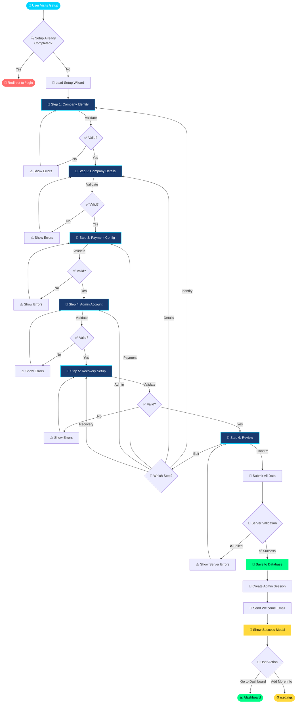
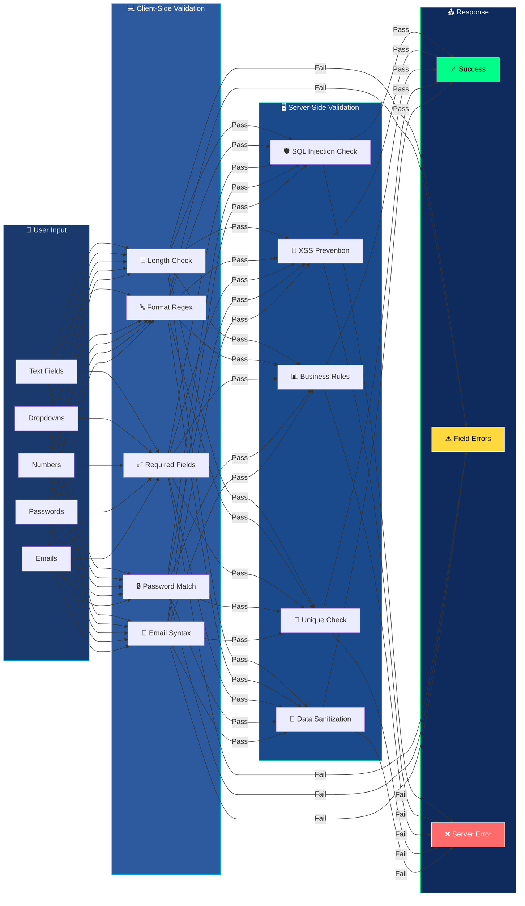
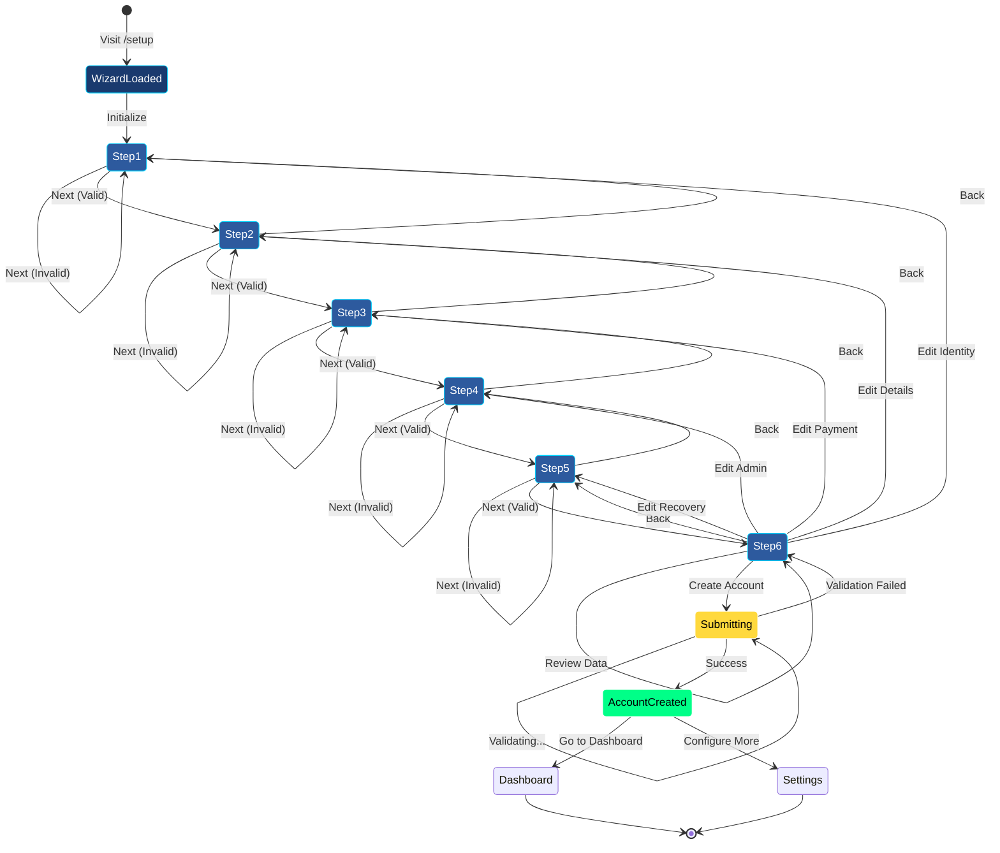
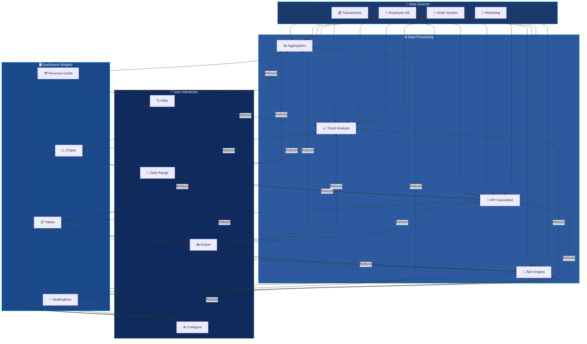

# 📊 Digital Business Simulator — Account Creation & Dashboard Guide

> **Complete visual walkthrough of the multi-step onboarding wizard, account creation flow, and dashboard features.**

---

<div align="center">

  
  
  
  
  

</div>

---

## 🎯 Table of Contents

| Section | Description |
|---------|-------------|
| [🚀 Overview](#-overview) | Project introduction & key features |
| [🎨 UI/UX Design System](#-uiux-design-system) | Color palette, typography & animations |
| [📋 Step-by-Step Wizard Flow](#-step-by-step-wizard-flow) | Complete 6-step account creation |
| [🔐 Account Creation Flowchart](#-account-creation-flowchart) | Visual process diagram |
| [🖥️ Dashboard Features](#-dashboard-features) | Main dashboard capabilities |
| [📡 API Endpoints](#-api-endpoints) | Backend route reference |
| [🛠️ Tech Stack](#-tech-stack) | Technologies used |

---

## 🚀 Overview

**Digital Business Simulator (DBS)** is a comprehensive business management web application that guides users through a **6-step wizard-based onboarding process** to create their company profile, configure payment methods, set up administrator accounts, and establish recovery options.

### ✨ Key Highlights

<div align="center">

| Feature | Status |
|---------|--------|
| 🎯 6-Step Wizard Onboarding | ✅ Active |
| 💳 Multi-Payment Gateway Support | ✅ Active |
| 🔐 Secure Admin Account Creation | ✅ Active |
| 🔄 Account Recovery System | ✅ Active |
| 📊 Real-time Business Dashboard | ✅ Active |
| 🌍 Multi-Currency & Timezone | ✅ Active |

</div>

---

## 🎨 UI/UX Design System

### 🌈 Color Palette

```css
:root {
  /* Primary Brand Colors */
  --primary-blue:    #1a3a6e;   /* Deep navy background */
  --secondary-blue:  #2d5a9e;   /* Card backgrounds */
  --accent-cyan:     #00d4ff;   /* Active states, highlights */
  --accent-teal:     #00b8a9;   /* Success, progress */

  /* Gradient System */
  --bg-gradient:     linear-gradient(135deg, #0f2b5e 0%, #1a4a8c 50%, #0d2d5a 100%);
  --card-gradient:   linear-gradient(180deg, rgba(255,255,255,0.08) 0%, rgba(255,255,255,0.02) 100%);

  /* Text Colors */
  --text-primary:    #ffffff;
  --text-secondary:  rgba(255,255,255,0.7);
  --text-muted:      rgba(255,255,255,0.5);

  /* Input Styles */
  --input-bg:        rgba(255,255,255,0.1);
  --input-border:    rgba(255,255,255,0.2);
  --input-focus:     #00d4ff;

  /* Button Styles */
  --btn-primary:     linear-gradient(135deg, #00d4ff 0%, #00b8a9 100%);
  --btn-secondary:   rgba(255,255,255,0.1);
}
```

### 🎬 Animation Specifications

```css
/* ============================================
   ANIMATION SYSTEM — Digital Business Simulator
   ============================================ */

/* 🌊 Page Load Entrance */
@keyframes fadeInUp {
  0%   { opacity: 0; transform: translateY(30px); }
  100% { opacity: 1; transform: translateY(0); }
}

/* ✨ Input Field Focus Glow */
@keyframes inputGlow {
  0%   { box-shadow: 0 0 0 0 rgba(0, 212, 255, 0); }
  50%  { box-shadow: 0 0 20px 4px rgba(0, 212, 255, 0.3); }
  100% { box-shadow: 0 0 0 0 rgba(0, 212, 255, 0); }
}

/* 🔄 Step Indicator Pulse */
@keyframes stepPulse {
  0%   { transform: scale(1); box-shadow: 0 0 0 0 rgba(0, 212, 255, 0.7); }
  70%  { transform: scale(1.05); box-shadow: 0 0 0 10px rgba(0, 212, 255, 0); }
  100% { transform: scale(1); box-shadow: 0 0 0 0 rgba(0, 212, 255, 0); }
}

/* 🎯 Progress Bar Fill */
@keyframes progressFill {
  0%   { width: 0%; }
  100% { width: var(--progress-percent); }
}

/* 💫 Card Hover Lift */
@keyframes cardLift {
  0%   { transform: translateY(0); box-shadow: 0 4px 20px rgba(0,0,0,0.2); }
  100% { transform: translateY(-5px); box-shadow: 0 12px 40px rgba(0,0,0,0.3); }
}

/* ⚡ Button Ripple Effect */
@keyframes ripple {
  0%   { transform: scale(0); opacity: 1; }
  100% { transform: scale(4); opacity: 0; }
}

/* 🌟 Success Checkmark */
@keyframes checkmark {
  0%   { stroke-dashoffset: 100; }
  100% { stroke-dashoffset: 0; }
}

/* Application Classes */
.animate-fadeInUp    { animation: fadeInUp 0.6s ease-out forwards; }
.animate-inputGlow   { animation: inputGlow 2s ease-in-out infinite; }
.animate-stepPulse   { animation: stepPulse 2s ease-in-out infinite; }
.animate-progress    { animation: progressFill 0.8s ease-out forwards; }
.animate-cardLift    { transition: all 0.3s ease; }
.animate-cardLift:hover { animation: cardLift 0.3s ease forwards; }
```

### 📝 Typography

| Element | Font | Size | Weight | Color |
|---------|------|------|--------|-------|
| App Title | Inter | 28px | 700 | `#ffffff` |
| Step Title | Inter | 22px | 600 | `#ffffff` |
| Labels | Inter | 13px | 500 | `rgba(255,255,255,0.8)` |
| Inputs | Inter | 14px | 400 | `#ffffff` |
| Buttons | Inter | 14px | 600 | `#ffffff` |

---

## 📋 Step-by-Step Wizard Flow

### 🧭 Step Indicator Component

```
┌─────────────────────────────────────────────────────────┐
│  ┌────┐  ┌────┐  ┌────┐  ┌────┐  ┌────┐  ┌────┐       │
│  │ 1  │  │ 2  │  │ 3  │  │ 4  │  │ 5  │  │ 6  │       │
│  │ ✓  │  │ ✓  │  │ ●  │  │ ○  │  │ ○  │  │ ○  │       │
│  └────┘  └────┘  └────┘  └────┘  └────┘  └────┘       │
│   Done    Done   Active  Pending Pending Pending        │
└─────────────────────────────────────────────────────────┘
```

**Animation Rules:**
- ✅ **Completed Steps**: Cyan fill (`#00d4ff`) + white checkmark + subtle glow
- 🔵 **Active Step**: Pulsing cyan ring (`animate-stepPulse`) + filled center
- ⚪ **Pending Steps**: Transparent with white border (`rgba(255,255,255,0.3)`)
- 🔄 **Transition**: 300ms ease-out scale + color morph

---

### 📑 Step 1 — Company Identity

<div align="center">


</div>

**Purpose:** Collect basic company identification information.

| Field | Type | Required | Validation |
|-------|------|----------|------------|
| 🏢 Company Name | Text | ✅ Yes | Min 2 chars, alphanumeric |
| 🏪 Business Name | Text | ✅ Yes | Min 2 chars |
| 👤 Owner Name | Text | ✅ Yes | Min 2 chars, letters only |
| 👔 CEO Name | Text | ✅ Yes | Min 2 chars, letters only |
| 🏭 Industry | Dropdown | ❌ No | Predefined list |
| 🏷️ Business Type | Dropdown | ❌ No | Startup / SME / Enterprise |

**UI Layout:**
```
┌─────────────────────────────────────────────────────────┐
│  🏢 Company Identity                                    │
│  ─────────────────────────────────────────────────────  │
│                                                         │
│  ┌─────────────────────┐  ┌─────────────────────┐       │
│  │ Company Name *      │  │ Business Name *     │       │
│  │ [________________]  │  │ [________________]  │       │
│  └─────────────────────┘  └─────────────────────┘       │
│                                                         │
│  ┌─────────────────────┐  ┌─────────────────────┐       │
│  │ Owner Name *        │  │ CEO Name *          │       │
│  │ [________________]  │  │ [________________]  │       │
│  └─────────────────────┘  └─────────────────────┘       │
│                                                         │
│  ┌─────────────────────┐  ┌─────────────────────┐       │
│  │ Industry            │  │ Business Type       │       │
│  │ [▼ Select Industry] │  │ [▼ Startup        ] │       │
│  └─────────────────────┘  └─────────────────────┘       │
│                                                         │
│                              ┌────────┐  ┌────────┐    │
│                              │  Back  │  │  Next ➜ │    │
│                              └────────┘  └────────┘    │
└─────────────────────────────────────────────────────────┘
```

**Animations:**
- 🎬 Form slides in from bottom (`fadeInUp` 0.5s delay stagger per row)
- ✨ Input focus triggers `inputGlow` animation
- 🔄 Dropdown opens with 200ms slide-down + fade

---

### 📑 Step 2 — Company Details

<div align="center">


</div>

**Purpose:** Capture operational and financial details.

| Field | Type | Required | Default | Validation |
|-------|------|----------|---------|------------|
| 👥 Company Size | Dropdown | ❌ No | "1-10" | 1-10 / 11-50 / 51-200 / 200+ |
| 🔢 Employee Count | Number | ❌ No | 10 | Positive integer |
| 💰 Annual Revenue | Number | ❌ No | 1000000 | Positive number |
| 💱 Currency | Dropdown | ❌ No | "USD" | USD / EUR / GBP / INR |
| 🌍 Country | Dropdown | ❌ No | "United States" | ISO country list |
| 🏙️ City | Text | ❌ No | — | Min 2 chars |
| 🕐 Timezone | Dropdown | ✅ Yes | "UTC (Universal)" | IANA timezone list |
| 🧾 Tax Type | Dropdown | ❌ No | "GST" | GST / VAT / Sales Tax |
| 📊 Tax Rate (%) | Number | ❌ No | 18 | 0-100 range |
| 📝 Company Description | Textarea | ❌ No | — | Max 500 chars |

**UI Layout:**
```
┌─────────────────────────────────────────────────────────┐
│  📋 Company Details                                     │
│  ─────────────────────────────────────────────────────  │
│                                                         │
│  ┌─────────────────────┐  ┌─────────────────────┐       │
│  │ Company Size        │  │ Employee Count      │       │
│  │ [▼ 1-10           ] │  │ [10               ] │       │
│  └─────────────────────┘  └─────────────────────┘       │
│                                                         │
│  ┌─────────────────────┐  ┌─────────────────────┐       │
│  │ Annual Revenue      │  │ Currency            │       │
│  │ [1000000          ] │  │ [▼ USD            ] │       │
│  └─────────────────────┘  └─────────────────────┘       │
│                                                         │
│  ┌─────────────────────┐  ┌─────────────────────┐       │
│  │ Country             │  │ City                │       │
│  │ [▼ United States  ] │  │ [________________]  │       │
│  └─────────────────────┘  └─────────────────────┘       │
│                                                         │
│  ┌─────────────────────┐  ┌─────────────────────┐       │
│  │ Timezone *          │  │ Tax Type            │       │
│  │ [▼ UTC (Universal)] │  │ [▼ GST            ] │       │
│  └─────────────────────┘  └─────────────────────┘       │
│                                                         │
│  ┌─────────────────────┐                                │
│  │ Tax Rate (%)        │                                │
│  │ [18               ] │                                │
│  └─────────────────────┘                                │
│                                                         │
│  ┌─────────────────────────────────────────────────┐    │
│  │ Company Description                              │    │
│  │ [                                               │    │
│  │  _____________________________________________  │    │
│  │  _____________________________________________  │    │
│  │                                               ] │    │
│  └─────────────────────────────────────────────────┘    │
│                                                         │
│                              ┌────────┐  ┌────────┐    │
│                              │  Back  │  │  Next ➜ │    │
│                              └────────┘  └────────┘    │
└─────────────────────────────────────────────────────────┘
```

**Animations:**
- 📊 Number inputs animate on change (count-up effect)
- 🌍 Country dropdown shows flag icons with search filter
- 📝 Textarea auto-expands with smooth height transition

---

### 📑 Step 3 — Payment Configuration

<div align="center">


</div>

**Purpose:** Configure all payment receiving methods.

| Field | Type | Required | Placeholder | Validation |
|-------|------|----------|-------------|------------|
| 📱 UPI ID | Text | ❌ No | "name@upi" | Valid UPI format |
| 🔗 UPI Link | URL | ❌ No | — | Valid URL |
| 🏦 Bank Name | Text | ❌ No | — | Min 2 chars |
| 🔢 Account Number | Text | ❌ No | — | Numeric only |
| 🏷️ IFSC Code | Text | ❌ No | — | 11-char alphanumeric |
| 🌐 Payment Gateway Link | URL | ❌ No | — | Valid URL |
| 💳 Payment Link | URL | ❌ No | — | Valid URL |
| 💬 WhatsApp Business | Text | ❌ No | — | Phone format |

**UI Layout:**
```
┌─────────────────────────────────────────────────────────┐
│  💳 Payment Configuration                               │
│  ─────────────────────────────────────────────────────  │
│                                                         │
│  ┌─────────────────────┐  ┌─────────────────────┐       │
│  │ UPI ID              │  │ UPI Link            │       │
│  │ [name@upi         ] │  │ [________________]  │       │
│  └─────────────────────┘  └─────────────────────┘       │
│                                                         │
│  ┌─────────────────────┐  ┌─────────────────────┐       │
│  │ Bank Name           │  │ Account Number      │       │
│  │ [________________]  │  │ [________________]  │       │
│  └─────────────────────┘  └─────────────────────┘       │
│                                                         │
│  ┌─────────────────────┐  ┌─────────────────────┐       │
│  │ IFSC Code           │  │ Payment Gateway Link│       │
│  │ [________________]  │  │ [________________]  │       │
│  └─────────────────────┘  └─────────────────────┘       │
│                                                         │
│  ┌─────────────────────┐  ┌─────────────────────┐       │
│  │ Payment Link        │  │ WhatsApp Business   │       │
│  │ [________________]  │  │ [________________]  │       │
│  └─────────────────────┘  └─────────────────────┘       │
│                                                         │
│                              ┌────────┐  ┌────────┐    │
│                              │  Back  │  │  Next ➜ │    │
│                              └────────┘  └────────┘    │
└─────────────────────────────────────────────────────────┘
```

**Animations:**
- 💳 Payment method icons animate on input focus
- ✅ Real-time format validation with shake animation on error
- 🔒 Secure fields show lock icon with fade-in

---

### 📑 Step 4 — Administrator Account

<div align="center">


</div>

**Purpose:** Create the primary administrator account with security questions.

| Field | Type | Required | Validation |
|-------|------|----------|------------|
| 👤 Username | Text | ✅ Yes | 3-20 chars, alphanumeric + underscore |
| 📧 Email | Email | ✅ Yes | Valid email format |
| 🔒 Password | Password | ✅ Yes | Min 8 chars, 1 upper, 1 lower, 1 number, 1 special |
| 🔒 Confirm Password | Password | ✅ Yes | Must match password |
| ❓ Security Question 1 | Dropdown | ❌ No | Predefined questions |
| 📝 Answer 1 | Text | ❌ No | Min 2 chars |
| ❓ Security Question 2 | Dropdown | ❌ No | Predefined questions |
| 📝 Answer 2 | Text | ❌ No | Min 2 chars |

**Default Security Questions:**
| Question ID | Question Text |
|-------------|---------------|
| q1 | What was your childhood nickname? |
| q2 | What is your mother's maiden name? |
| q3 | What was the name of your first pet? |
| q4 | What was the make of your first car? |
| q5 | What elementary school did you attend? |

**UI Layout:**
```
┌─────────────────────────────────────────────────────────┐
│  🛡️ Administrator Account                               │
│  ─────────────────────────────────────────────────────  │
│                                                         │
│  ┌─────────────────────┐  ┌─────────────────────┐       │
│  │ Username *          │  │ Email *             │       │
│  │ [________________]  │  │ [________________]  │       │
│  └─────────────────────┘  └─────────────────────┘       │
│                                                         │
│  ┌─────────────────────┐  ┌─────────────────────┐       │
│  │ Password *          │  │ Confirm Password *  │       │
│  │ [••••••••••••    ] │  │ [••••••••••••    ] │       │
│  └─────────────────────┘  └─────────────────────┘       │
│                                                         │
│  ┌─────────────────────────────────────────────────┐      │
│  │ Password Strength: ████████░░░░  Strong       │      │
│  └─────────────────────────────────────────────────┘      │
│                                                         │
│  ┌─────────────────────────────────────────────────┐      │
│  │ Security Question 1                              │      │
│  │ [▼ What was your childhood nickname?           ] │      │
│  │ [Answer                                         ] │      │
│  └─────────────────────────────────────────────────┘      │
│                                                         │
│  ┌─────────────────────────────────────────────────┐      │
│  │ Security Question 2                              │      │
│  │ [▼ What is your mother's maiden name?          ] │      │
│  │ [Answer                                         ] │      │
│  └─────────────────────────────────────────────────┘      │
│                                                         │
│                              ┌────────┐  ┌────────┐    │
│                              │  Back  │  │  Next ➜ │    │
│                              └────────┘  └────────┘    │
└─────────────────────────────────────────────────────────┘
```

**Animations:**
- 🔒 Password field shows strength meter with color transitions
  - 🔴 Weak → 🟡 Medium → 🟢 Strong → 🔵 Very Strong
- 👁️ Toggle password visibility with icon morph
- ⚠️ Mismatch error triggers horizontal shake animation

---

### 📑 Step 5 — Recovery Setup

<div align="center">


</div>

**Purpose:** Set up account recovery options for password reset and access restoration.

| Field | Type | Required | Validation |
|-------|------|----------|------------|
| 📧 Recovery Email | Email | ✅ Yes | Valid email, different from admin email |
| 📱 Recovery Phone | Tel | ❌ No | Valid phone number with country code |

**UI Layout:**
```
┌─────────────────────────────────────────────────────────┐
│                    ┌────┐                               │
│                    │ DS │                               │
│                    └────┘                               │
│           Digital Business Simulator                    │
│              Set up account recovery                    │
│                                                         │
│  ┌────┐  ┌────┐  ┌────┐  ┌────┐  ┌────┐  ┌────┐       │
│  │ ✓  │  │ ✓  │  │ ✓  │  │ ✓  │  │ ●  │  │ ○  │       │
│  └────┘  └────┘  └────┘  └────┘  └────┘  └────┘       │
│                                                         │
│  🔐 Recovery Setup                                      │
│  ─────────────────────────────────────────────────────  │
│                                                         │
│  ┌─────────────────────┐  ┌─────────────────────┐       │
│  │ Recovery Email *    │  │ Recovery Phone      │       │
│  │ [________________]  │  │ [________________]  │       │
│  └─────────────────────┘  └─────────────────────┘       │
│                                                         │
│                              ┌────────┐  ┌────────┐    │
│                              │  Back  │  │  Next ➜ │    │
│                              └────────┘  └────────┘    │
└─────────────────────────────────────────────────────────┘
```

**Animations:**
- 📧 Email validation shows checkmark/X icon with pop animation
- 📱 Phone input auto-formats with country flag detection
- 🔔 Warning banner if recovery email matches admin email

---

### 📑 Step 6 — Review & Confirm

<div align="center">


</div>

**Purpose:** Final review of all entered data before account creation.

**Review Sections:**

```
┌─────────────────────────────────────────────────────────┐
│  ✅ Review & Confirm                                    │
│  ─────────────────────────────────────────────────────  │
│                                                         │
│  ┌─ 📑 Company Identity ───────────────────────────┐    │
│  │  🏢 Company:    TechStart Innovations            │    │
│  │  🏪 Business:   TechStart Solutions              │    │
│  │  👤 Owner:      John Smith                       │    │
│  │  👔 CEO:        Jane Doe                         │    │
│  │  🏭 Industry:   Technology                       │    │
│  │  🏷️ Type:      Startup                          │    │
│  └──────────────────────────────────────────────────┘    │
│                                                         │
│  ┌─ 📋 Company Details ────────────────────────────┐    │
│  │  👥 Size:       1-10 employees                   │    │
│  │  💰 Revenue:    $1,000,000 USD                   │    │
│  │  🌍 Location:   United States, New York          │    │
│  │  🕐 Timezone:   UTC (Universal)                  │    │
│  │  🧾 Tax:        GST @ 18%                        │    │
│  └──────────────────────────────────────────────────┘    │
│                                                         │
│  ┌─ 💳 Payment Methods ────────────────────────────┐    │
│  │  📱 UPI:        john@upi                         │    │
│  │  🏦 Bank:       HDFC Bank ••••1234               │    │
│  │  💳 Gateway:    Configured                       │    │
│  │  💬 WhatsApp:   +1-555-0123                      │    │
│  └──────────────────────────────────────────────────┘    │
│                                                         │
│  ┌─ 🛡️ Administrator ───────────────────────────────┐    │
│  │  👤 Username:   admin_john                       │    │
│  │  📧 Email:      john@techstart.com               │    │
│  │  🔒 Password:   ••••••••••••••••                 │    │
│  └──────────────────────────────────────────────────┘    │
│                                                         │
│  ┌─ 🔐 Recovery ──────────────────────────────────┐    │
│  │  📧 Email:      recovery@techstart.com           │    │
│  │  📱 Phone:      +1-555-0199                      │    │
│  └──────────────────────────────────────────────────┘    │
│                                                         │
│  [✓] I agree to the Terms of Service and Privacy Policy │
│                                                         │
│                              ┌────────┐  ┌────────┐    │
│                              │  Back  │  │ 🚀 Create │    │
│                              └────────┘  └────────┘    │
└─────────────────────────────────────────────────────────┘
```

**Animations:**
- 📋 Each section expands/collapses with smooth accordion animation
- ✏️ Edit links navigate directly to corresponding step
- 🚀 Create button triggers confetti + success modal

---

## 🔐 Account Creation Flowchart

### 🔄 Complete Process Flow



---

### 🧩 Data Validation Flow



---

### 📊 State Management Flow



---

## 🖥️ Dashboard Features

<div align="center">


</div>

### 📊 Main Dashboard Layout

```
┌─────────────────────────────────────────────────────────────────────┐
│  🖥️ Digital Business Simulator — Dashboard                           │
│  ┌─────────────────────────────────────────────────────────────────┐│
│  │  🔍 Search...          🔔 3  💬 5  👤 Admin ▼                  ││
│  └─────────────────────────────────────────────────────────────────┘│
│                                                                     │
│  ┌────────────┐  ┌────────────┐  ┌────────────┐  ┌────────────┐   │
│  │ 💰 Revenue │  │ 📈 Growth  │  │ 👥 Team    │  │ 🛒 Orders  │   │
│  │ $125,000   │  │ +23.5%     │  │ 12         │  │ 89         │   │
│  │ ↑ 12%      │  │ ↑ 5.2%     │  │ +2 new     │  │ ↑ 8%       │   │
│  └────────────┘  └────────────┘  └────────────┘  └────────────┘   │
│                                                                     │
│  ┌────────────────────────────┐  ┌────────────────────────────┐   │
│  │ 📊 Revenue Chart            │  │ 📈 Sales Analytics          │   │
│  │                             │  │                             │   │
│  │    ╱╲    ╱╲    ╱╲╱╲        │  │  ┌─┐                        │   │
│  │   ╱  ╲  ╱  ╲  ╱    ╲       │  │  │█│ █                     │   │
│  │  ╱    ╲╱    ╲╱      ╲___   │  │  │█│██ █                   │   │
│  │                            │  │  └─┘                        │   │
│  │  Jan  Feb  Mar  Apr  May   │  │  Q1  Q2  Q3  Q4           │   │
│  └────────────────────────────┘  └────────────────────────────┘   │
│                                                                     │
│  ┌────────────────────────────┐  ┌────────────────────────────┐   │
│  │ 🔔 Recent Activities      │  │ 📋 Quick Actions            │   │
│  │ • New order #1234         │  │  [+ New Invoice]             │   │
│  │ • Payment received $500   │  │  [+ Add Employee]            │   │
│  │ • Employee John joined    │  │  [📊 View Reports]           │   │
│  │ • Tax filing due in 3d    │  │  [⚙️ Settings]               │   │
│  └────────────────────────────┘  └────────────────────────────┘   │
│                                                                     │
│  ┌─────────────────────────────────────────────────────────────┐   │
│  │ 🏢 Company Status: Active  |  🕐 Last Login: 2 mins ago     │   │
│  └─────────────────────────────────────────────────────────────┘   │
└─────────────────────────────────────────────────────────────────────┘
```

### 🎯 Dashboard Feature Matrix

| Module | Features | Status |
|--------|----------|--------|
| **📊 Analytics** | Revenue charts, Growth metrics, Trend analysis | ✅ Live |
| **💰 Finance** | Invoices, Expenses, Tax calculator, Reports | ✅ Live |
| **👥 HR** | Employee directory, Payroll, Attendance | ✅ Live |
| **🛒 Sales** | Orders, Customers, Products, Inventory | ✅ Live |
| **📢 Marketing** | Campaigns, Social media, Email templates | ✅ Live |
| **⚙️ Settings** | Profile, Payment, Security, Notifications | ✅ Live |

---

### 📈 Dashboard Data Flow



---

## 📡 API Endpoints

### 🔌 Setup Wizard API

| Method | Endpoint | Description | Auth |
|--------|----------|-------------|------|
| `GET` | `/api/setup/status` | Check if setup is complete | No |
| `POST` | `/api/setup/step/1` | Save Company Identity | No |
| `POST` | `/api/setup/step/2` | Save Company Details | No |
| `POST` | `/api/setup/step/3` | Save Payment Config | No |
| `POST` | `/api/setup/step/4` | Save Admin Account | No |
| `POST` | `/api/setup/step/5` | Save Recovery Setup | No |
| `POST` | `/api/setup/complete` | Finalize & Create Account | No |

### 🔐 Authentication API

| Method | Endpoint | Description |
|--------|----------|-------------|
| `POST` | `/api/auth/login` | Admin login |
| `POST` | `/api/auth/logout` | Logout session |
| `POST` | `/api/auth/recover` | Account recovery request |
| `POST` | `/api/auth/reset-password` | Password reset |

### 📊 Dashboard API

| Method | Endpoint | Description |
|--------|----------|-------------|
| `GET` | `/api/dashboard/summary` | Get dashboard summary |
| `GET` | `/api/dashboard/revenue` | Revenue data with filters |
| `GET` | `/api/dashboard/employees` | Employee statistics |
| `GET` | `/api/dashboard/orders` | Order analytics |

---

## 🛠️ Tech Stack

<div align="center">

| Layer | Technology | Badge |
|-------|-----------|-------|
| **Backend** | Python Flask |  |
| **Frontend** | HTML5 + CSS3 + JS |  |
| **Styling** | Custom CSS |  |
| **Database** | JSON File Storage |  |
| **Charts** | Chart.js |  |
| **Icons** | Font Awesome |  |
| **Fonts** | Google Fonts (Inter) |  |

</div>

---

## 🎬 Animation Cheat Sheet

| Animation | CSS Class | Duration | Use Case |
|-----------|-----------|----------|----------|
| Fade In Up | `.animate-fadeInUp` | 0.6s | Page transitions |
| Input Glow | `.animate-inputGlow` | 2s loop | Input focus state |
| Step Pulse | `.animate-stepPulse` | 2s loop | Active step indicator |
| Progress Fill | `.animate-progress` | 0.8s | Progress bar updates |
| Card Lift | `.animate-cardLift` | 0.3s | Hover effects |
| Button Ripple | `.ripple` | 0.6s | Button clicks |
| Success Check | `.animate-checkmark` | 0.5s | Form completion |
| Shake Error | `.animate-shake` | 0.5s | Validation errors |

---

<div align="center">

## 🏆 Digital Business Simulator

**Built with 💙 by [issu321](https://github.com/issu321)**

[](https://github.com/issu321)
[](https://github.com/issu321/Analysis-of-Algorithms)

---

*© 2026 Digital Business Simulator. All rights reserved.*

</div>
